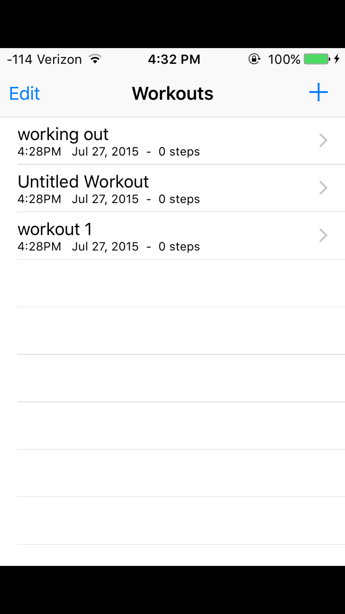
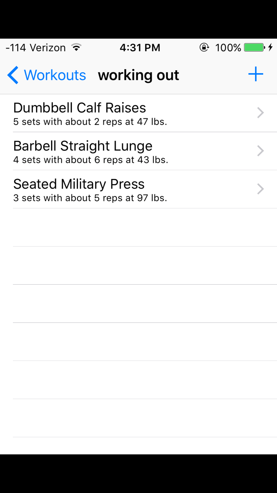
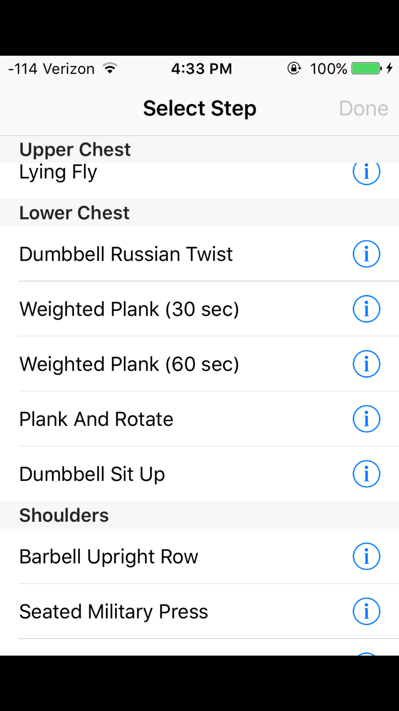
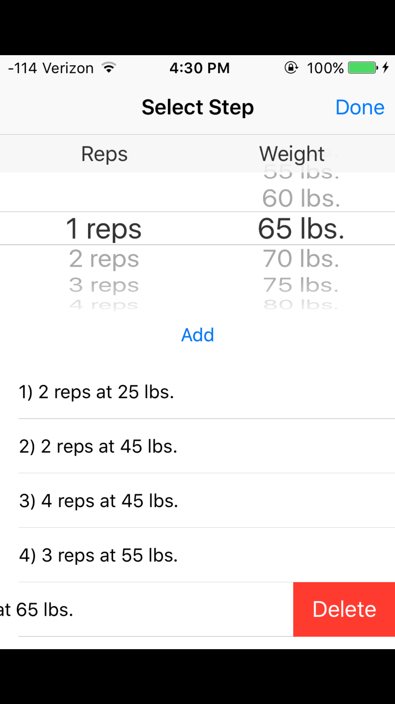

# BenchTracker_iOS
## Intro
This app uses Core Data to record, analyze, and display a user's workouts through cataloging date, duration, exercises, sets, rep details, and more. In addition, the local Core Data stores are regularly synced with [Amazon Web Services](https://aws.amazon.com) servers so they can be synced across devices and eventually cross-platform. By using a simple username system, a user can easily log into their account on any iOS device ad keep track of their workout.

## Installation
#### AWS Servers
This app's backend uses Amazon Web Services to store user data, workouts, and custom exercise types. The DynamoDB pool and S3 bucket are authenticated using a [Cognito](https://aws.amazon.com/cognito/) unauth identity.

[Amazon DynamoDB](https://aws.amazon.com/dynamodb/) is used as a database solution that stores both users and workouts. The user table is indexed with the tag ```username``` while the workout table is indexed under the tag ```uuid```. This app writes and reads to this database whenever the user updates their workouts and regularly checks the database for updates in an attempt to sync its local Core Data storage.

[Amazon S3](https://aws.amazon.com/s3/) is used as a storage solution for text files containing custom user-created lists of exercise types. Each user has their own variation stored under (their-username).txt and is versioned whenever an update is made. Public read permissions to the bucket must be [enabled](https://stackoverflow.com/questions/2547046/make-a-bucket-public-in-amazon-s3) to successfully receive the text files client-side.

#### BenchTrackerKeys.h
In order to get the app to fully function correctly, the file 'BenchTrackerKeys.h' must be created and put in the 'BenchTracker' project folder. The file should look something like this:
```obj-c
#ifndef BenchTrackerKeys_h
#define BenchTrackerKeys_h

#define AWS_POOL_ID              @"POOD-ID"

#define AWS_USERS_TABLE_NAME     @"table-name"
#define AWS_WORKOUTS_TABLE_NAME  @"other-table-name"

#define AWS_BUCKET_NAME          @"bucket-name"
#define DEFAULT_LIST_NAME        @"defaultName.txt"

#endif
```

#### Cocoapods
[Cocoapods](https://cocoapods.org) is a dependency manager for Swift and ObjC projects. This app does not require additional setup to enable the pods to be used. This app uses the following pods and frameowrks:
* [AWS iOS SDK](https://github.com/aws/aws-sdk-ios) - database solution
* [JSONModel](https://github.com/jsonmodel/jsonmodel) - data translation
* [ZFDragableModalTransition](https://github.com/zoonooz/ZFDragableModalTransition) - popup views
* [Core Data](https://developer.apple.com/library/content/documentation/Cocoa/Conceptual/CoreData/index.html) - on-device data storage

## Images
#### User login

#### Main view

#### Workout in progress

#### Exercise list

#### Rep tracking




