# BenchTracker_iOS

## [View on the iOS App Store](https://itunes.apple.com/us/app/bench-tracker-workout-weight-lifting-log/id1266077653)
Bench Tracker is the only app designed by workout enthusiasts; for workout enthusiasts. We love working out just as much as you do, so we wrote the perfect app to track and analyze your workouts so you can maximize those gains!

COMPLETELY AD-FREE / PREMIUM-FREE:
* The only workout app with absolutely no ads and no premium mode

TRACK YOUR WORKOUTS:
* The only workout app with a colorful, useful workout overview display
* View your workouts in one of three ways: List, Weekly, or Calendar
* Export and import your data to switch between devices with ease

ADVANCED WORKOUT FEATURES:
* The only workout app with a weightlifting equivalency chart
* The only workout app with camera-based workout sharing
* Easily superset up to 5 exercises and add sets all at once
* Two methods for inputting sets for maximum ease of use
* Easily print out any workout via AirPrint

ANALYZE EVERY ASPECT:
* Analyze workout volume, duration, and muscle splits for every workout
* View your progress on each exercise: graphed out and organized
* Seamlessly determine your one-rep max for any exercise
* Find your favorite exercises and browse new ones
* View weekly summaries prepared each week highlighting your advancements

CUSTOMIZE YOUR EXERCISES:
* Create, name, and categorize any exercise
* Choose from one of 5 different ways to track your exercise
* Add variations to view your progress for each type
* Settings to disable screen sleep, change weight unit, and more

## Intro
This app uses Core Data to record, analyze, and display a user's workouts through cataloging date, duration, exercises, sets, rep details, and more. In addition, the local Core Data stores are regularly compared with their counterparts stored on [Amazon Web Services](https://aws.amazon.com) servers so they can be synced across devices and eventually cross-platform. By using a simple username system, a user can easily log into their account on any iOS device and keep track of their workouts. Additionaly, users can export their workouts to PDF form and print them so they can be saved phyically in addition to electronically. QR codes included in the PDF can be used to re-digitize the workout at any time or create an empty replica.

#### Backend Syncing
Whenever a user opens up their app, the AWS user with the matching ```username``` is pulled from DynamoDB. Both versions of the user's ```recentEdits``` are then compared and the appropriate workouts are downloaded and deleted. The local and server ```exerciseTypeListVersions``` are then compared to determine whether or not an updated version must be downloaded. Whenever either of these updates are made, the fetched AWS object must be translated into its Core Data counterpart and vice versa when uploading. To save space and speed up server calls, certain data such as exercises are strategically converted into JSON format. Translating back and forth provides the advantage of speed and accessibility client-side and effieiency server-side.

#### QR code generation and scanning
To make sharing workouts between users more effortless, a system of QR code generation has been implimented. Furthermore, this implimentation has the advantage of offline usability as it is not server-dependent. With the help of the MJExtension library, advanced techniques are used to dramatically downsize workout data objects to a more managable size (for example: a sample workout was shortened from 2600+ characters to 960 without any data loss). These raw JSON strings are then translated in QR codes and can be either displayed on the device itself or printed out. Any user is then welcome to scan the code and instantly either load the same workout with dates, durations, sets and more preserved or use it as a template for their own workout (no sets etc.).

#### User data import / export
Data import / export is used both as a form of unit testing and as a practical way for users to migrate from device to device. To accomplish this task, JSONModel equivilents to every Core Data class was written along with a ```BTDataTransferManager``` class. This class exports data by serializing user settings, custom exercises, and workouts into a JSON object and attaching it to an email. By defining a custom '.btd' file type, whenever another device opens the attachment it will automattically link to the Bench Tracker app. Importing involves taking the JSON string, turning it into a JSONModel object, and parsing through the object to reform the Core Data objects. Each JSON attachment comes with a ```version``` tag and the app will reject any newer version in case I decide to change the JSON format.

## Installation
#### Test Data
If you would like to test the app using a pre-defined set of 20 workouts, you can use the ```BTTestData.btd``` file included in this repo.

#### AWS Servers
This app's backend uses Amazon Web Services to store user data, workouts, and custom exercise types. The DynamoDB pool and S3 bucket are authenticated using a [Cognito](https://aws.amazon.com/cognito/) unauth identity.

[Amazon DynamoDB](https://aws.amazon.com/dynamodb/) is used as a database solution that stores both users and workouts. The user table is indexed with the tag ```username``` while the workout table is indexed under the tag ```uuid```. This app writes and reads to this database whenever the user updates their workouts and regularly checks the database for updates in an attempt to sync its local Core Data storage.

[Amazon S3](https://aws.amazon.com/s3/) is used as a storage solution for text files containing custom user-created lists of exercise types. Each user has their own variation stored under (their-username).txt and is versioned whenever an update is made. Public read permissions to the bucket must be [enabled](https://stackoverflow.com/questions/2547046/make-a-bucket-public-in-amazon-s3) to successfully receive the text files client-side.

#### BenchTrackerKeys.h
In order to get the app to fully function correctly, the file 'BenchTrackerKeys.h' must be created and put in the 'BenchTracker' project folder. The file should look something like this:
```obj-c
#ifndef BenchTrackerKeys_h
#define BenchTrackerKeys_h

#define AWS_POOL_ID              @"POOD-ID"

#define AWS_USERS_TABLE_NAME     @"table-name"
#define AWS_WORKOUTS_TABLE_NAME  @"other-table-name"

#define AWS_BUCKET_NAME          @"bucket-name"
#define DEFAULT_LIST_NAME        @"defaultName.txt"

#define AWS_EMPTY                @"<EMPTY>"

#endif
```

#### Cocoapods
[Cocoapods](https://cocoapods.org) is a dependency manager for Swift and ObjC projects. This app does not require additional setup to enable the pods to be used. This app uses the following pods and frameowrks:
* [AWS iOS SDK](https://github.com/aws/aws-sdk-ios) - database solution
* [JSONModel](https://github.com/jsonmodel/jsonmodel) - JSON serialization for server
* [ZFDragableModalTransition](https://github.com/zoonooz/ZFDragableModalTransition) - popup views
* [HMSegmentedControl](https://github.com/HeshamMegid/HMSegmentedControl) - custom segmented control
* [FSCalendar](https://github.com/WenchaoD/FSCalendar) - calendar view
* [MGSwipeTableCell](https://github.com/MortimerGoro/MGSwipeTableCell) - swipe-for-actions table cells
* [MJExtension](https://github.com/CoderMJLee/MJExtension) - workout JSON serialization for QR codes
* [MMQRCodeScanner](https://github.com/dexianyinjiu/MMQRCodeScanner) - QR code generation and scanning
* [StickyCollectionView](https://github.com/matbeich/StickyCollectionView) - Analytics view card animation
* [PNChart](https://github.com/kevinzhow/PNChart) - Analytics view graphs
* [AppIRater](https://github.com/arashpayan/appirater) - App store review reminder
* [Toast](https://github.com/scalessec/Toast) - Workout template add toast popup
* [Onboard](https://github.com/mamaral/Onboard) - Tutorial splashscreen
* [Core Data](https://developer.apple.com/library/content/documentation/Cocoa/Conceptual/CoreData/index.html) - on-device data storage
* [Core Graphics / Text](https://developer.apple.com/library/content/documentation/StringsTextFonts/Conceptual/CoreText_Programming/Overview/Overview.html) - workout PDF generation

## Images
#### User login


#### Main view & templates
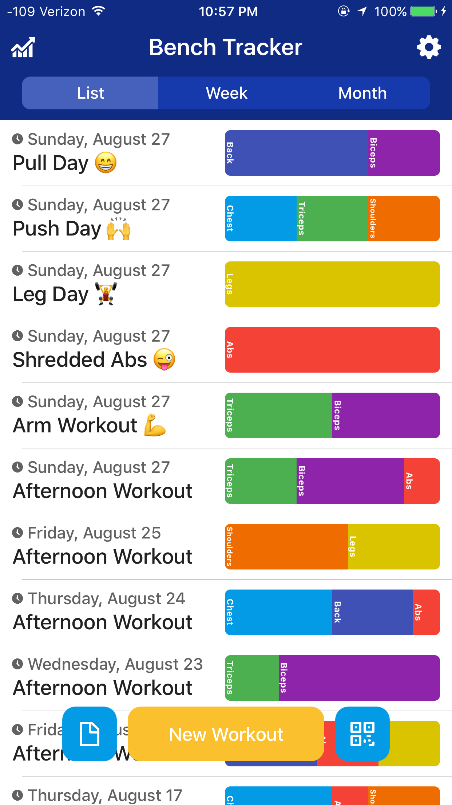


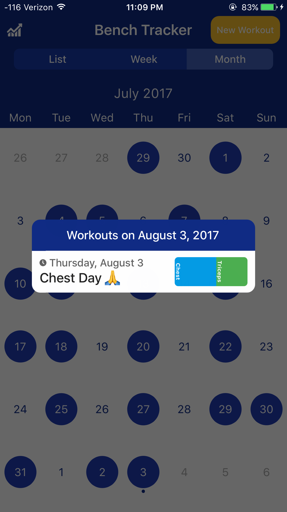
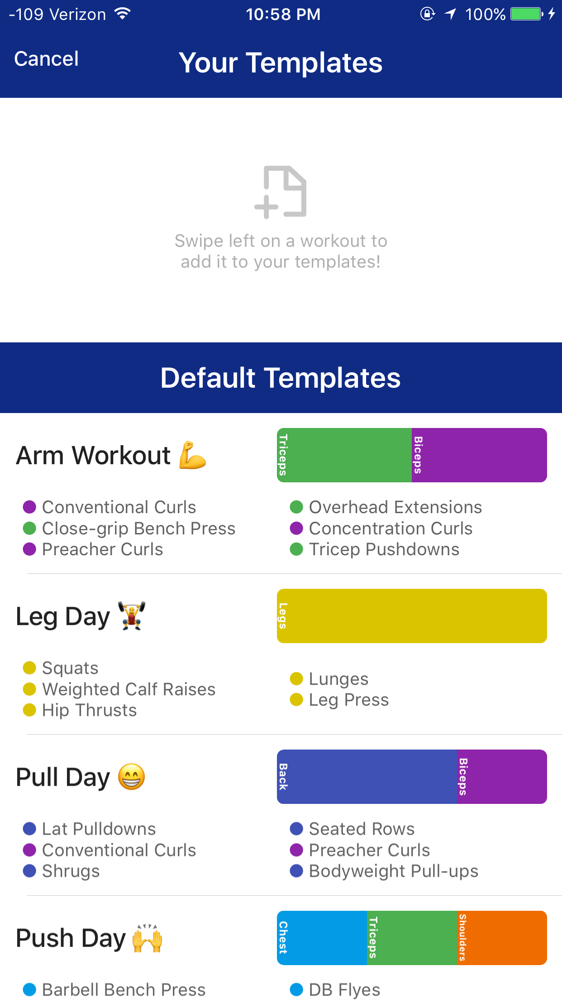

#### Workout in progress


#### Exercise selection
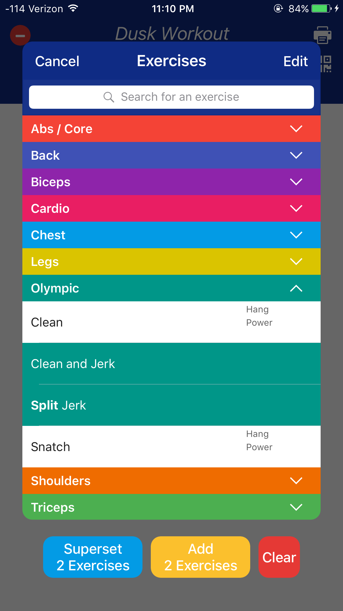

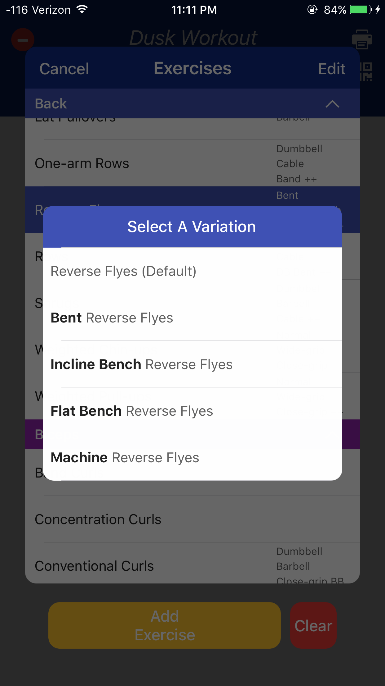

#### Rep tracking

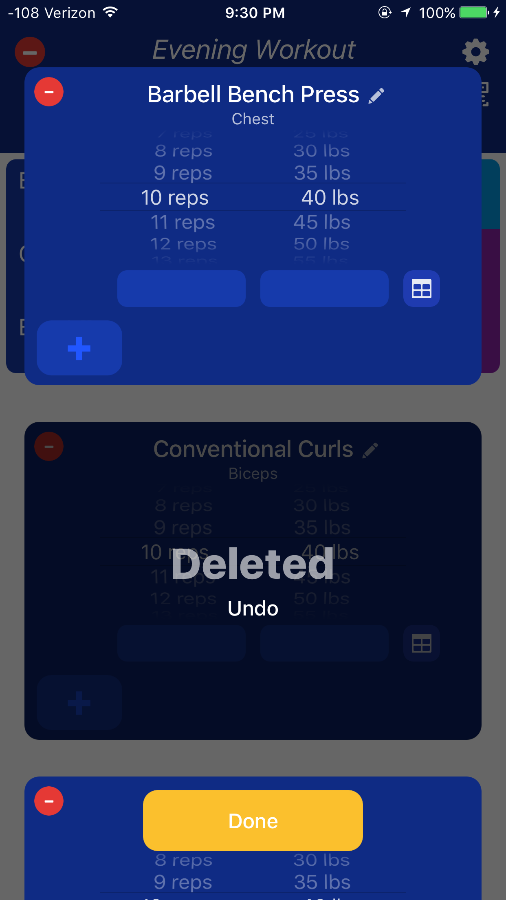
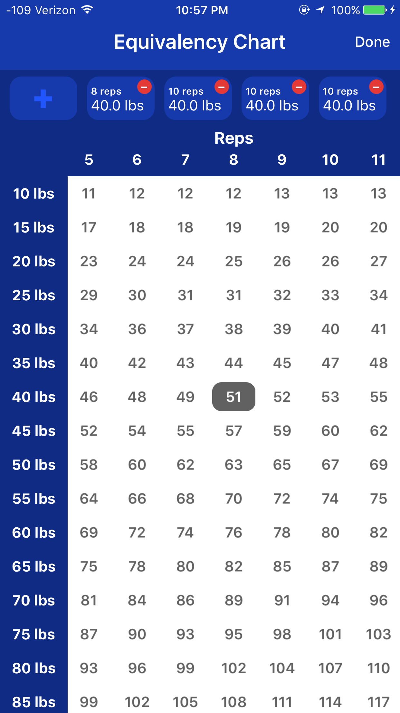

#### Analytics card views
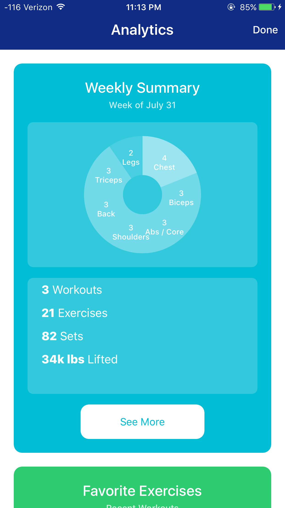


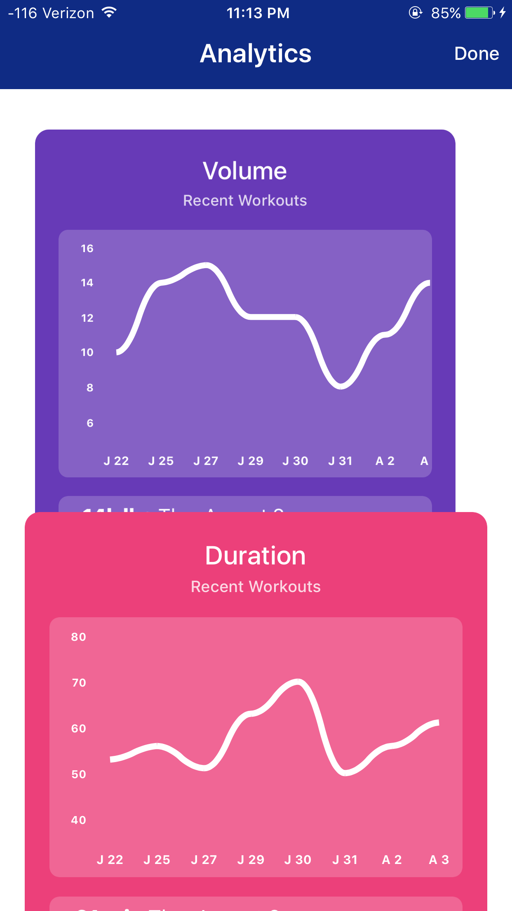
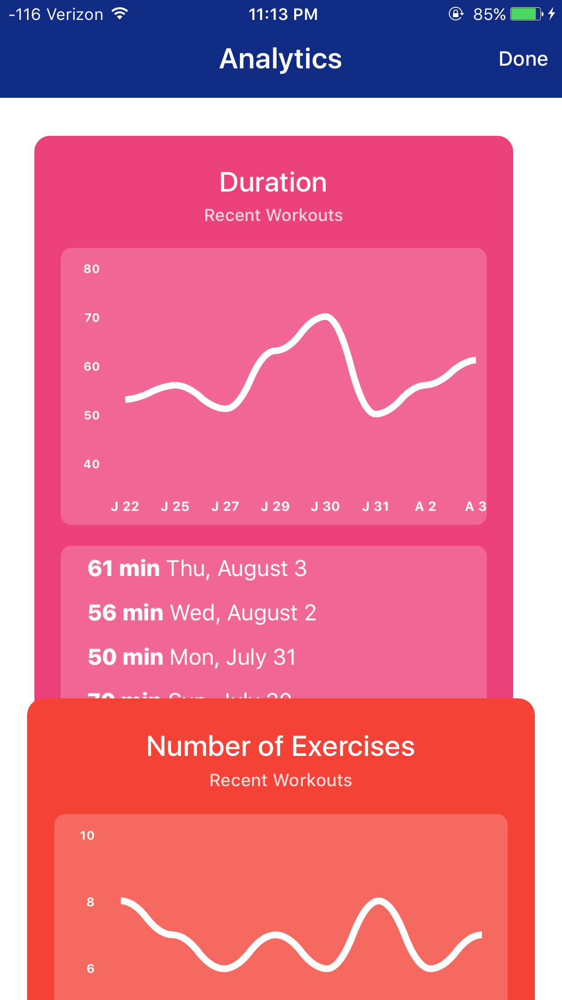
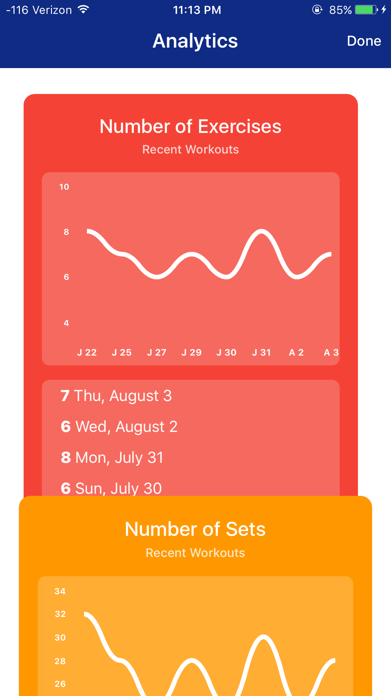


#### Analytics detail views
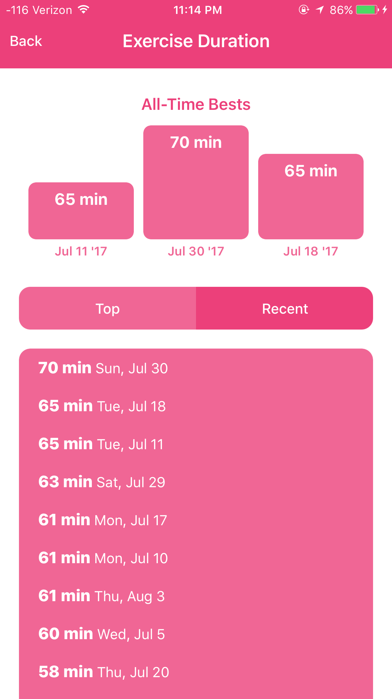
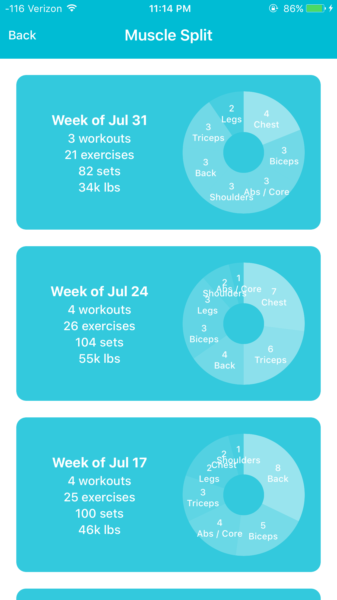

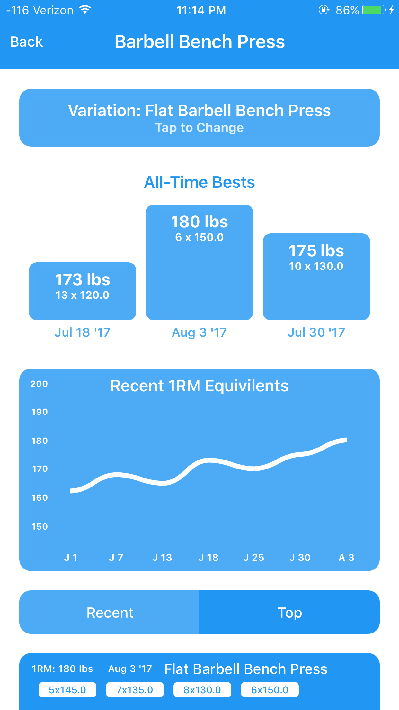

#### Settings & custom exercises


#### Export workout to PDF


#### QR code generation and scanning


